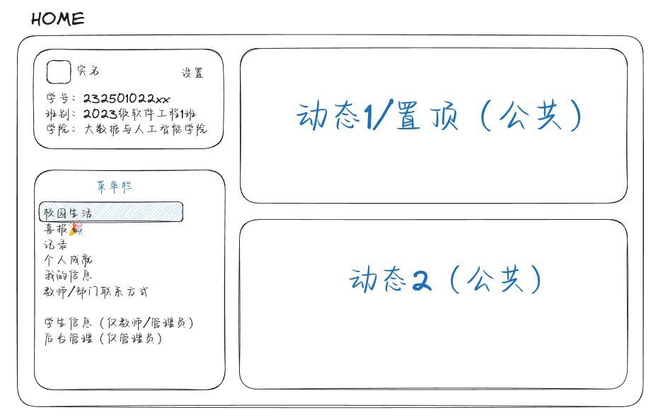
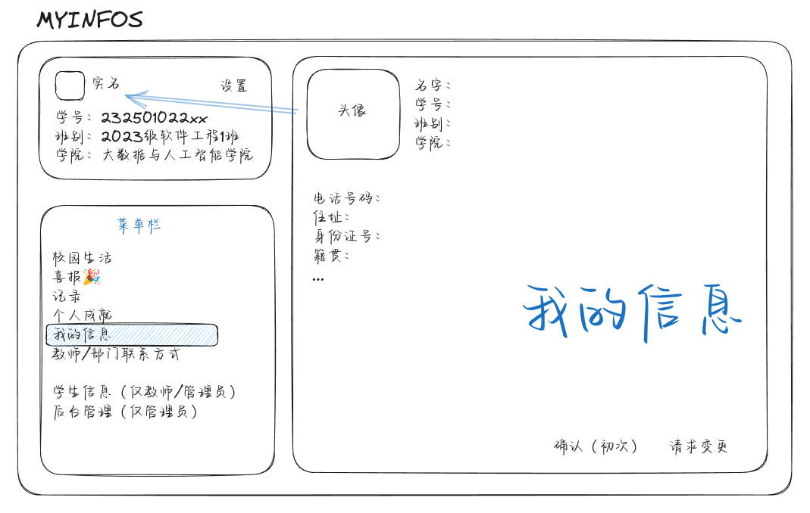
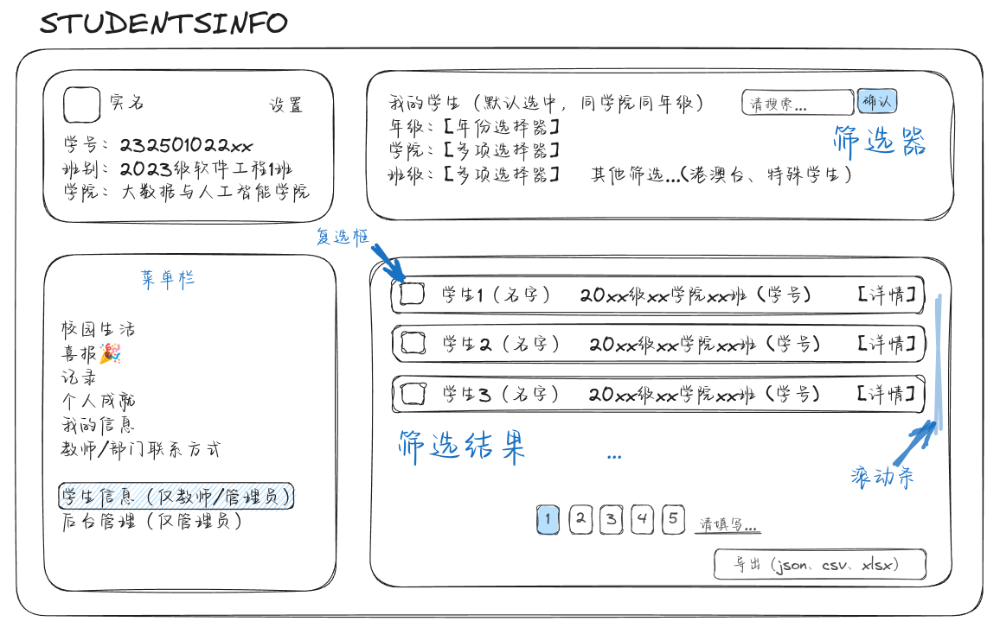
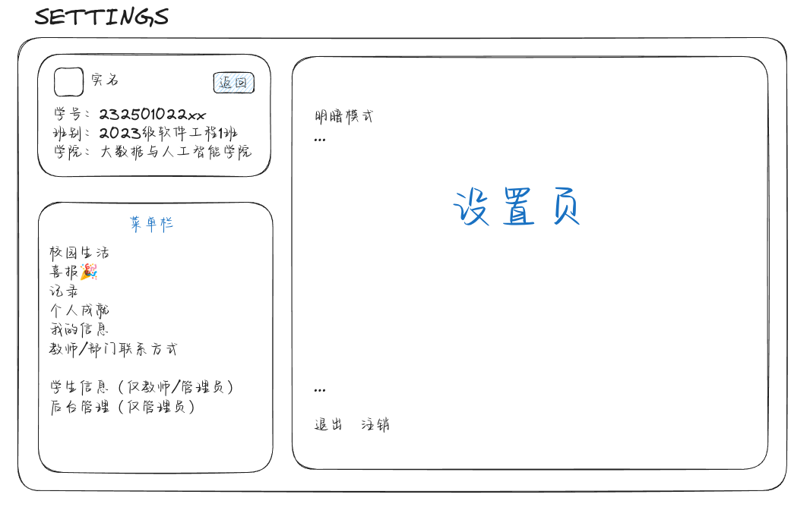
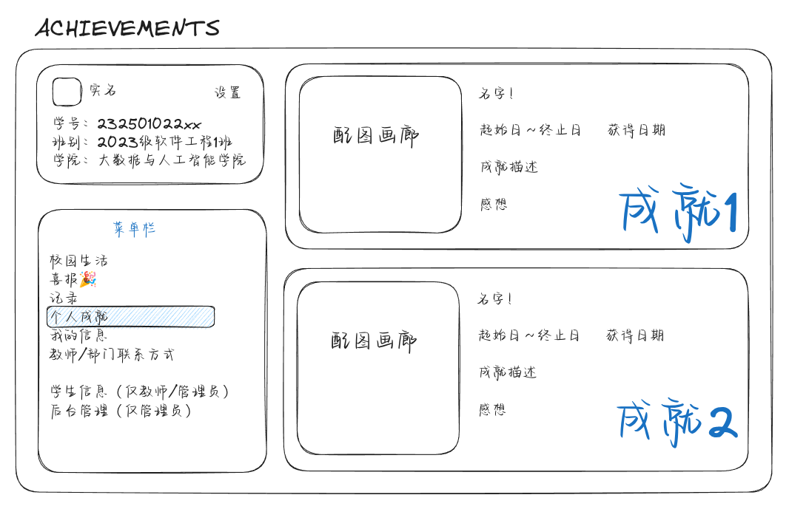
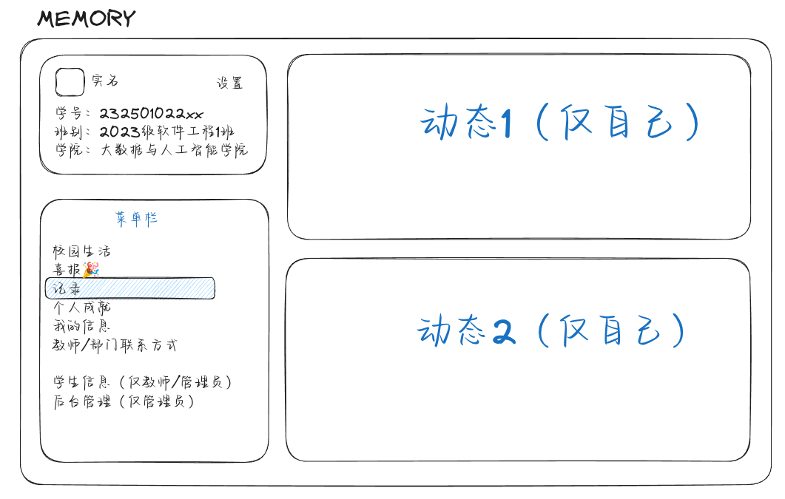
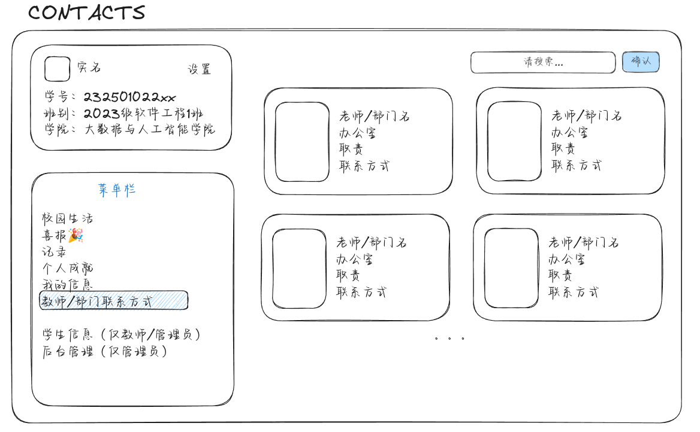

# BDAI-SC 学生中心（注册/登录）

当前实现：

- `backend/`：Java 21 + Spring Boot + Maven + MySQL
- `frontend/`：Vue 3 + Vite
- 功能：用户名/密码登录、显示名称+用户名+密码注册
- 鉴权：JWT（登录/注册返回 `token`，前端自动携带 `Authorization`）

## quickStart

### 1. 数据库准备

<h1 align="center">BDAI-SC</h1>

<p align="center">

[](https://openjdk.org/projects/jdk/21/)
[](https://spring.io/projects/spring-boot)
[](https://vuejs.org/)
[](https://www.mysql.com/)
[](https://github.com/jwtk/jjwt)

</p>
  
---

## 技术栈

### 后端

| 技术            | 版本   | 用途       |
| --------------- | ------ | ---------- |
| Java            | 21     | 运行时     |
| Spring Boot     | 3.3.5  | Web 框架   |
| Spring Security | 6.x    | 认证与授权 |
| JPA / Hibernate | 6.x    | ORM        |
| MySQL           | 8.0    | 数据库     |
| JJWT            | 0.12.6 | JWT 令牌   |
| Maven           | 3.x    | 构建工具   |

### 前端

| 技术              | 版本 | 用途        |
| ----------------- | ---- | ----------- |
| Vue               | 3.5  | UI 框架     |
| Vite              | 5.4  | 构建工具    |
| Vue Router        | 4.4  | 路由        |
| Axios             | 1.7  | HTTP 客户端 |
| AG Grid           | 31.3 | 数据表格    |
| jsPDF + autoTable | 2.5  | PDF 导出    |
| xlsx              | 0.18 | Excel 导出  |
| docx-preview      | 0.3  | Word 预览   |

---

## 快速启动

### 前置条件

- JDK 21+
- Node.js 18+
- MySQL 8.0+
- Maven 3.9+

### 1. 配置环境

```bash
cp .env.example .env
```

按需修改 `.env` 中的数据库密码、JWT 密钥等配置。

### 2. 创建数据库

> > > > > > > main

```sql
# 或使用自己的账号密码
CREATE DATABASE IF NOT EXISTS gcsc DEFAULT CHARACTER SET utf8mb4;
CREATE USER IF NOT EXISTS 'gcsc'@'localhost' IDENTIFIED BY 'gcsc';
GRANT ALL PRIVILEGES ON gcsc.* TO 'gcsc'@'localhost';
FLUSH PRIVILEGES;
```

### 2. 启动后端

```bash
cd backend
mvn spring-boot:run
```

后端默认地址：`http://localhost:8080`

若启动时报 `Unable to determine Dialect without JDBC metadata`，按下面检查：

- 确认 MySQL 已启动，并且 `gcsc` 库存在。
- 确认连接用户是 `gcsc`，不是 `gcsc@localhost:3306` 这样的完整串。
- 用下面命令手工验证连接：

```bash
mysql -ugcsc -pgcsc -h127.0.0.1 -P3306 -e "use gcsc; show tables;"
```

### 3. 启动前端

```bash
cd frontend
npm install
npm run dev
```

前端默认地址：`http://localhost:5173`

## 实现说明

- 后端
  - 用户表：`backend/src/main/java/com/gcsc/studentcenter/entity/AppUser.java`
  - 注册/登录：`backend/src/main/java/com/gcsc/studentcenter/service/AuthService.java`
  - JWT：`backend/src/main/java/com/gcsc/studentcenter/service/JwtService.java`
  - 认证过滤器：`backend/src/main/java/com/gcsc/studentcenter/config/JwtAuthenticationFilter.java`
- 前端
  - 登录页：`frontend/src/views/LoginView.vue`
  - 注册页：`frontend/src/views/RegisterView.vue`
  - 首页：`frontend/src/views/HomeView.vue`

```
GCSC/
├── backend/                                # Spring Boot 后端
│   ├── src/main/java/com/gcsc/studentcenter/
│   │   ├── StudentCenterApplication.java   # 启动类
│   │   ├── config/                         # 安全配置、CORS、JWT 过滤器
│   │   ├── controller/                     # REST 控制器
│   │   │   ├── AuthController.java         # 登录/注册
│   │   │   ├── AchievementController.java  # 成就 CRUD
│   │   │   ├── StudentProfileController.java # 学生档案
│   │   │   ├── AdminController.java        # 管理后台
│   │   │   ├── UploadController.java       # 文件上传
│   │   │   └── SystemSettingsController.java
│   │   ├── service/                        # 业务逻辑层
│   │   ├── repository/                     # 数据访问层
│   │   ├── entity/                         # JPA 实体
│   │   ├── dto/                            # 请求/响应 DTO
│   │   └── exception/                      # 全局异常处理
│   ├── src/main/resources/
│   │   └── application.yml                 # 主配置（从 .env 导入变量）
│   └── pom.xml
│
├── frontend/                          # Vue 3 前端
│   ├── src/
│   │   ├── api/                       # Axios 请求模块
│   │   │   ├── request.js             # axios 实例 + 拦截器
│   │   │   ├── auth.js                # 认证
│   │   │   ├── profile.js             # 学生档案
│   │   │   └── achievements.js        # 成就接口
│   │   ├── assets/styles/             # 全局 CSS
│   │   │   ├── _variables.css         # CSS 变量
│   │   │   ├── layout.css             # 布局
│   │   │   ├── dialogs.css            # 对话框/Toast
│   │   │   └── achievements.css       # 成就页样式
│   │   ├── components/                # Vue 组件
│   │   ├── composables/               # 组合式函数
│   │   ├── constants/                 # 菜单/成就类型常量
│   │   ├── layouts/                   # 页面布局（DashboardLayout）
│   │   ├── router/                    # Vue Router 配置
│   │   ├── utils/                     # 导出/渲染/工具函数
│   │   └── views/                     # 页面级组件
│   │       ├── LoginView.vue          # 登录
│   │       ├── RegisterView.vue       # 注册
│   │       ├── AchievementsView.vue   # 成就墙
│   │       ├── MyInfosView.vue        # 我的信息
│   │       ├── StudentInfoView.vue    # 学生信息（教师/管理员）
│   │       ├── NotificationsView.vue  # 通知中心
│   │       └── AdminView.vue          # 管理后台
│   ├── index.html
│   ├── vite.config.js
│   └── package.json
│
├── assets/                            # 产品截图
├── scripts/                           # 工具脚本
└── .env.example                       # 环境配置示例
```

## Git 提交规范

- `feat:` 新功能
- `style:` 仅样式改动
- `fix:` 修复问题
- `docs:` 文档改动
- `refactor:` 重构（不改功能）
- `chore:` 工程维护
- 前缀后建议使用中文描述，例如：`feat: 完成注册登录接口`

## TODO

1. [x] 注册登录 ✅ 2026-03-06
2. [ ] 分角色（学生/教师/管理员）
3. [ ] 填写信息（学生）
4. [ ] 导出信息（教师）
5. [ ] 发布近期成就/动态（教师/学生）
6. [ ] 社区互动（教师/学生）
7. [ ] 分学院（看情况）
8. TODO: 页面设计增加logo的位置

## 页面设计预览

### 主页

登录进来就看见的页面，左上为目前登录信息小卡片，左下为不同分区的菜单栏，右侧为学院内动态/置顶公告。


### 我的信息

个人信息页，学生在该页面填写个人信息，初次登录会提示进入该页面填写，后续更改需要请求变更（或取消该限制，直接更改）


### 学生信息（仅教师/管理员）

教师/管理员可以在此页面筛选学生，并选择对应的学生导出信息。


### 设置页

设置页，点击小卡片右上角可进入，目前还没想好有什么可以设置的。


### 成就页

成就页，学生可在成就页记录自己的成就。成就可配图（证书，记录等），形成画廊展示。可以为该成就补充信息，如名字，经历时间，获得成就的日期，该成就的描述，个人感想等。


### 记录页

记录页，该页面为学生记录的隐私动态，仅自己可见。


### 教师联系方式

联系页，学生可在该页面查看老师/部门的联系方式。


### 文件

| 方法 | 路径          | 说明                                 |
| ---- | ------------- | ------------------------------------ |
| POST | `/api/upload` | 上传文件（支持图片/视频/PDF/Office） |
| GET  | `/uploads/**` | 访问已上传文件                       |

---

## 成就类型

| 类型 | 实体                       | 关键字段                               |
| ---- | -------------------------- | -------------------------------------- |
| 竞赛 | `AchievementContest`       | 竞赛名称、奖项等级、获奖人数、获奖日期 |
| 科研 | `AchievementResearch`      | 项目名称、项目负责人、指导教师工号     |
| 论文 | `AchievementPaper`         | 论文题目、期刊名称、发表日期、收录情况 |
| 专利 | `AchievementPatent`        | 专利名称、专利类型、授权号、授权日期   |
| 证书 | `AchievementCertificate`   | 证书名称、证书类型、获得日期           |
| 作品 | `AchievementWorks`         | 作品名称、发布场合、影响范围           |
| 期刊 | `AchievementJournal`       | 刊物名称、作品题目、发表日期           |
| 双百 | `AchievementDoubleHundred` | 双百工程相关                           |
| 培训 | `AchievementIeerTraining`  | 培训记录                               |

所有成就类型均支持：标题、描述、图片附件、创建时间、关联作者。

---

## 角色权限

| 功能         | STUDENT        | CADRE | TEACHER | ADMIN |
| ------------ | -------------- | ----- | ------- | ----- |
| 登录/注册    | ✅             | ✅    | ✅      | ✅    |
| 管理个人档案 | ✅（提交审核） | ✅    | ✅      | ✅    |
| 提交成就     | ✅             | ✅    | ✅      | ✅    |
| 审核成就     | ❌             | 本班  | ✅      | ✅    |
| 审核档案变更 | ❌             | 本班  | ✅      | ✅    |
| 查看学生档案 | 仅本人         | 本班  | 所管    | 全部  |
| 导出学生信息 | ❌             | ❌    | ✅      | ✅    |
| 系统设置     | ❌             | ❌    | ❌      | ✅    |
| 管理用户角色 | ❌             | ❌    | ❌      | ✅    |

> STUDENT 是默认角色, CADRE是班干部, TEACHER是老师, ADMIN是管理员

---

## 配置说明

所有配置通过 `.env` 文件管理，Spring Boot 通过 `application.yml` 中的 `spring.config.import` 自动导入：

```bash
# 关键配置项
BDAI_SC_DB_URL=jdbc:mysql://127.0.0.1:3306/bdai_sc?useUnicode=true&...
BDAI_SC_DB_USER=bdai_sc
BDAI_SC_DB_PASSWORD=bdai_sc
BDAI_SC_JWT_SECRET=your-super-secret-key
BDAI_SC_JWT_EXPIRES_MINUTES=120
BDAI_SC_UPLOAD_DIR=./uploads                # 文件存储目录
VITE_API_BASE=http://localhost:8080         # 前端 API 地址
```

---

## 开发指南

### 后端

```bash
# 运行
mvn spring-boot:run

# 构建 JAR
mvn clean package

# 运行测试
mvn test

# 单个测试类
mvn test -Dtest=AuthServiceTest
```

### 前端

```bash
# 安装依赖
npm install

# 开发服务器
npm run dev

# 生产构建
npm run build

# 预览构建结果
npm run preview
```

### 添加新成就类型

1. 在 `backend/entity/` 创建新实体，继承通用结构
2. 在 `backend/repository/` 创建对应的 `JpaRepository`
3. 在 `backend/controller/` 添加 REST 控制器
4. 在 `frontend/src/constants/achievementConstants.js` 添加类型常量
5. 在 `frontend/src/api/` 添加 API 请求模块
6. 在前端视图或成就页中接入

### 前端组件规范

- 使用 `<script setup>` 组合式 API
- 全局按钮样式：`ghost-button`（描边）、`action-button`（填充）
- 对话框使用 `sheet-overlay` / `sheet-modal` 模式（见 `dialogs.css`）
- 动画时长：`0.42s cubic-bezier(0.22, 1, 0.36, 1)`（transform）、`0.38s ease`（opacity）

---

## 贡献规范

### Git 提交规范

```
feat:     新功能
fix:      修复问题
style:    仅样式改动
docs:     文档改动
refactor: 重构（不改变功能）
chore:    工程维护
```

前缀后使用中文描述，如：`feat: 添加学生档案导出功能`

### 分支命名

```
feat/feature-name     # 新功能
fix/bug-description   # Bug 修复
page/page-name        # 新页面
style/description     # 样式调整
```

---

## 许可证

本项目仅供学习与内部使用。

> > > > > > > main
